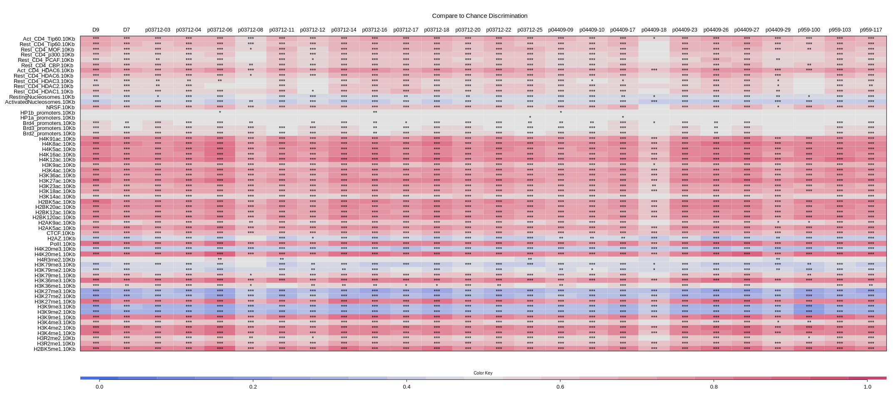
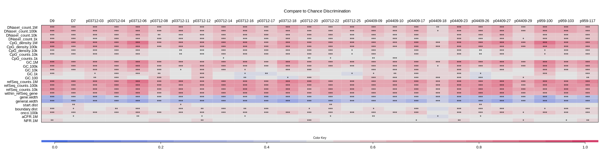

# Introduction

The samples studied in this report, the numbers of sequence reads, recovered integration vectors, and unique integration
sites available for this subject are shown below. We quantify population clone diversity using Gini coefficients, Shannon index,
and UC50. The Gini coefficient provides a measure of inequality in clonal abundance in each sample. The coefficient equals zero
when all sites are equally abundant (polyclonal) and increases as fewer sites account for more of the total (oligoclonal).
Shannon index is another widely used measure of diversity and it accounts for both abundance and evenness of the integration events.
Alternatively, the UC50 is the number of unique clones which make up the top 50% of the sample's abundance. For polyclonal samples,
one may expect a low Gini coefficient, high Shannon Index, and high UC50 (proportional to the total number of unique sites identified
in the sample).

Under most circumstances only a subset of sites will be sampled. We thus include an estimate of sample size based on frequency of
isolation information from the SonicLength method @berry2012. The 'S.chao1' column denotes the estimated lower bound for population
size derived using Chao estimate @chao1987. If sample replicates were present then estimates were subjected to jackknife bias correction.

We estimate the numbers of cell clones sampled using the SonicLength method @berry2012; this is summarized in the column “Inferred cells”.
Integration sites were recovered using ligation mediated PCR after random fragmentation of genomic DNA, which reduces recovery biases compared
with restriction enzyme cleavage. Relative abundance was not measured from read counts, which are known to be inaccurate, but from marks
introduced into DNA specimens prior to PCR amplification using the SonicLength method @berry2012.

We quantify population diversity using Gini coefficients, Shannon index, and UC50. The Gini coefficient provides a measure of inequality
in clonal abundance in each sample. The coefficient equals zero when all sites are equally abundant (polyclonal) and increases as fewer
sites account for more of the total (oligoclonal). Shannon index is another widely used measure of diversity and it accounts for both
abundance and evenness of the integration events. UC50 is the number of clones which make up the top 50% of the sample's abundance.
For polyclonal samples, one may expect a low Gini coefficient, high Shannon Index, and high UC50 (proportional to the total number
of unique sites identified in the sample).

Integration positions are reported with the format (nearest gene, chromosome, +/-, genomic position) where the nearest gene is the nearest
transcriptional boundary to the integration position, '+' refers to integration in the positive orientation and '-' refers to integration in
the reverse orientation. Reported distances are signed where where the sign indicates if integrations are upstream (-) or downstream (+, no sign)
of the nearest gene. Nearest genes possess additional annotations described in the table below.


```{r setup, message = FALSE, warning = FALSE, echo=FALSE}
knitr::opts_chunk$set(
	message = FALSE,
	warning = FALSE,
	echo = FALSE,
	fig.pos = 'H'
)
library(gt23)
library(RMySQL)
library(dplyr)
library(geneRxCluster)
library(tidyr)
library(kableExtra)
library(TxDb.Hsapiens.UCSC.hg38.knownGene)
library(Homo.sapiens)
library(tidyverse)
library(randomForest)
library(knitr)
library(vegan)
library(reldist)


all_genes <- genes(TxDb.Hsapiens.UCSC.hg38.knownGene)

dbConn  <- dbConnect(MySQL(), group='specimen_management')
samples <- dbGetQuery(dbConn, 'select * from gtsp where Trial="Ghassemi_CART"')

if(! file.exists('intSites.rds')){
  intSites <- getDBgenomicFragments(samples$SpecimenAccNum, 'specimen_management', 'intsites_miseq') %>%
    stdIntSiteFragments() %>%
    collapseReplicatesCalcAbunds() %>%
    annotateIntSites()
  saveRDS(intSites, file ='intSites.rds')
} else {
  intSites <- readRDS('intSites.rds')
}

d <- data.frame(intSites)
d$patient <- ifelse(grepl('D7', d$timePoint), 'D7', 'D9')

```


```{r, echo=FALSE, results='asis'}
library(xtable)
o <- data.frame(Symbol = c('*', '~', '!'),
                Meaning=c('site is within a transcription unit',
                          'site is within 50kb of a cancer related gene',
                          'nearest gene was assocaited with lymphoma in humans'))
print(xtable(o, align='lll'), comment=FALSE, include.rownames = FALSE)
```


# Samples

```{r sampleTable}
#sample_table <- read.csv('summary.csv')
#sample_table$patient <- sub('^p', '', sample_table$patient)
#f_table <- sample_table %>% filter(GTSP %in% s) %>% mutate(dataSource=NULL, Included= NULL) %>% arrange(patient, Timepoint) %>% mutate(patient=ifelse(patient=='Patient5','Patient4',patient))

#openxlsx::write.xlsx(f_table, file = 'output/sample_table.xlsx')

#sample_table 
calculateUC50 <- function(abund){
  stopifnot(is.vector(abund) & is.numeric(abund))
  abund <- abund[order(abund)]
  accum <- sapply(1:length(abund), function(i){sum(abund[1:i])})
  length(accum[accum >= sum(abund)/2])
}


d %>% group_by(GTSP) %>%
  summarise(timePointDays = timePointDays[1],
            # Replicates    = n_distinct(sampleName),
            # Patient       = patient[1],
            Timepoint     = timePoint[1],
            CellType      = cellType[1],
            TotalReads    = ppNum(sum(reads)),
            InferredCells = ppNum(sum(estAbund)),
            UniqueSites   = ppNum(n_distinct(posid)),
            Gini          = sprintf("%.3f", gini(estAbund)),
            Chao1         = ppNum(round(estimateR(estAbund, index='chao')[2], 0)),
            Shannon       = sprintf("%.2f", diversity(estAbund)),
            Pielou        = sprintf("%.3f", diversity(estAbund)/log(specnumber(estAbund))),
            UC50          = ppNum(calculateUC50(estAbund))
  ) %>%
  ungroup() %>%
  arrange(timePointDays) %>%
  mutate(timePointDays = NULL) %>%
  kable( "latex", booktabs = TRUE) %>%
  kable_styling(latex_options = c("HOLD_position","striped","scale_down"))
```

```{r def_gene, include=FALSE, results='asis'}
list_genes <- function(chr,g_start,g_end) {
  temp <- intSites %>% GenomicRanges::as.data.frame(.) %>% filter(seqnames==chr & start>=g_start & start<=g_end)
  return(paste(unique(temp$nearestFeature),collapse = ' '))
}

list_all_genes <- function(seqnames,start,end,genes) {
  tmp_R <-GRanges(paste0(seqnames,':',start,'-',end,':*'))
  tmp <- subsetByOverlaps(genes, tmp_R)
  tmp_g <-  as.data.frame(org.Hs.egSYMBOL) %>% filter(gene_id %in% tmp$gene_id)
  #return(list(tmp$gene_id))
  #return(paste(tmp$gene_id,collapse = ' '))
  return(paste(tmp_g$symbol,collapse = " "))
}

#filtered_intSites <- group_by(data.frame(intSites), GTSP) %>% mutate(cellsPerSample = sum(estAbund)) %>% filter(cellsPerSample >= 100) %>% ungroup()

wb <- openxlsx::createWorkbook()
#cat("\\newpage")
```


```{r scan_stat}
g1 <- d %>% filter(patient == 'D7' )  %>% makeGRangesFromDataFrame(.,keep.extra.columns=TRUE)
g2 <- d %>% filter(patient == 'D9' )  %>% makeGRangesFromDataFrame(.,keep.extra.columns=TRUE)

D7_num <- g1 %>% GenomicRanges::as.data.frame() %>%nrow()
D9_num <- g2 %>% GenomicRanges::as.data.frame() %>%nrow()


d7vsd9 <- scanStats(g1,g2,gr1.label = "D7",gr2.label = "D9", kvals = "4L:20L") %>%
  GenomicRanges::as.data.frame(.) %>%
  arrange(clusterSource) %>%
#  filter(width < 1000000)  %>%
  rowwise() %>%
  mutate(genesIntsites=list_genes(as.character(seqnames),start,end),
         genesEntrez=list_all_genes(seqnames = seqnames,start = start,end = end,all_genes)) %>%
  ungroup() %>%
  rename(value1='countD9') %>% rename(value2='countD7') %>%
  mutate(start=ppNum(start),end=ppNum(end),width=ppNum(width),strand=NULL, clump.id=NULL) %>%
  relocate(countD9, .after = countD7)

openxlsx::addWorksheet(wb, "d7vsd9")
openxlsx::writeDataTable(wb,"d7vsd9",d7vsd9)
```

# Scan stats

Genes associated with the Scan intervals were retrieved using two methods. genesIntsites uses the closest gene to each insertion site. genesEntrez retrieve all genes from the Entrez database that intersects that interval. Those tables are also available in "Scan_stats.xlsx".

```{r scan_table}
d7vsd9 %>%
     kable( "latex", booktabs = TRUE, caption ="scan statistics") %>%
   kable_styling(latex_options = c("striped","HOLD_position","scale_down"))

openxlsx::saveWorkbook(wb, file = "Scan_stats.xlsx", overwrite = TRUE)

```


<!-- # Random Forest -->

```{r testing, eval=FALSE, include=FALSE}
kk <- d %>% group_by(nearestFeature,patient,GTSP) %>% summarise(val=sum(relAbund)) %>% ungroup() %>%
  group_by(nearestFeature) %>% mutate(num=n()) %>% filter(num>1) %>% mutate(sample=paste0(GTSP,'-',patient),num=NULL) %>% ungroup() %>% mutate(patient=NULL,GTSP=NULL)

rf_mat <- kk %>% pivot_wider(names_from=sample,values_from=val,values_fill=0) %>% column_to_rownames(var = 'nearestFeature')

rf2 <- randomForest(x=t(rf_mat),y=as.factor(c("d7","d7","d9","d9","d7","d9")), importance=TRUE, ntree=3000,classwt= c(1,1))


```


```{r, eval=FALSE, fig.cap="Random Forest most important genes", fig.height=9, include=FALSE, out.width="100%"}
rf2
varImpPlot(rf2, type = 1,main="")
```

\newpage
# hot ROCs

The ROC curve heatmaps were generated as described in @berry2014 (Berry et al., “Selection of Target Sites for Mobile DNA Integration in the Human Genome.”). They show how much the distribution of insertion sites across several genomic and epigenomic features differs from a random distribution. The heatmaps include D7 and D9 samples as well as some preinfusion samples from @nobles2020 (Nobles et al., “CD19-Targeting CAR T Cell Immunotherapy Outcomes Correlate with Genomic Modification by Vector Integration.”). All samples fallow roughly the same pattern for all features.
 
```{r, fig.align="center", fig.cap="Metagenomic features", out.width="100%"}
#convert -crop 2150x1000+60+0 main.svg main.png
 
```
 
```{r, fig.align="center", fig.cap="Genomic features", out.width="100%"}
  
```
\newpage
# Tracking of clonal abundances

## Relative abundance of cell clones

The relative abundances of cell clones is summarized in the stacked bar plots below. The cell fraction studied
is named at the top of each plot and the time points are marked at the bottom. The different bars in each panel
show the major cell clones, as marked by integration sites where the x-axis indicates time points and the y-axis
is scaled by proportion of the total cells sampled. The top 10 most abundant clones from each cell type have
been named by the nearest gene while the remaining sites are binned as low abundance (LowAbund; grey).
The total number of genomic fragments used to identify integration sites are listed atop of each plot.


```{r abundant,fig.width=10, fig.height=5, results='asis',fig.align="center"}
# prepare dataframe
d <- intSites %>% GenomicRanges::as.data.frame()

# Convert cell types to uppercase and remove leading and trailing white spaces.
d$cellType <- gsub('^\\s+|\\s+$', '', toupper(d$cellType))

d <- dplyr::group_by(d, timePoint, cellType) %>%
     dplyr::mutate(readsPerSample = sum(reads)) %>%
     dplyr::ungroup() %>%
     dplyr::group_by(timePoint, cellType, posid) %>%
     dplyr::mutate(readsRelAbund = (sum(reads) / readsPerSample[1])*100) %>%
     dplyr::ungroup() %>%
     dplyr::group_by(cellType, timePoint, GTSP) %>%
     dplyr::mutate(totalSampleFrags = sum(estAbund)) %>%
     dplyr::ungroup() %>%
     dplyr::group_by(cellType, timePoint) %>%
     dplyr::mutate(include = ifelse(totalSampleFrags == max(totalSampleFrags), 'yes', 'no')) %>%
     dplyr::ungroup()

# Add nearest feature flags.
d <- d %>%
  mutate(labeledNearestFeature = paste0(nearestFeature, ' ')) %>%
  mutate(labeledNearestFeature = ifelse(inFeature, paste0(labeledNearestFeature, '*'), labeledNearestFeature))

if('nearestOncoFeatureDist' %in% names(d))
  d <- mutate(d, labeledNearestFeature = ifelse(abs(nearestOncoFeatureDist) <= 50000, paste0(labeledNearestFeature, '~'), labeledNearestFeature))

if('nearestlymphomaFeatureDist' %in% names(d))
  d <- mutate(d, labeledNearestFeature = ifelse(abs(nearestlymphomaFeatureDist) <= 50000, paste0(labeledNearestFeature, '!'), labeledNearestFeature))


# Create label for unique intSites.
d$posidLabel <- paste0(d$labeledNearestFeature, '\n', d$posid)
numClones <- 10
d$dataSource <- 'Illumina'
# Create data frame needed to generate relative abundance plots.
abundantClones <- bind_rows(lapply(split(d, d$cellType), function(x){
#browser()
 #  Adjust the number of clones to return based on the number of sites per cell type.#
  if(nrow(x) < numClones) numClones <- nrow(x)

  # Sort nearest genes by abundance.
  x <- x[order(x$estAbund, decreasing = TRUE),]

  # Select clones to report.
  topClones <-  unique(x$posidLabel)[1:numClones]

  # For each time point, create a data frame for relative abundance plots
  bind_rows(lapply(split(x, x$timePoint), function(x2){

    lowAbundData <- dplyr::mutate(x2, posidLabel = 'LowAbund',
                                      totalCells = sum(estAbund),
                                      relAbund   = 100) %>%
                    dplyr::slice(1) %>%
                    dplyr::select(cellType, timePoint, dataSource, posidLabel, totalCells, timePointDays, relAbund)

    x3 <- subset(x2, posidLabel %in% topClones)
    if(nrow(x3) == 0) return(lowAbundData)
    x3$totalCells <- sum(x2$estAbund)

    lowAbundData$relAbund <- 100 - sum(x3$relAbund)
    bind_rows(lowAbundData,  dplyr::select(x3, cellType, timePoint, dataSource, posidLabel, totalCells, timePointDays, relAbund))
  }))
}))

library(RColorBrewer)
# Create named color vector for unique clones.
cloneColorsVector <- setNames(c('#eeeeee', colorRampPalette(brewer.pal(12, "Paired"))(n_distinct(abundantClones$posidLabel))),  c('LowAbund', unique(abundantClones$posidLabel)))

dataSourcelevels = sort(unique(abundantClones$dataSource))

abundantClonesPlots <- lapply(split(abundantClones, abundantClones$cellType), function(x){
  o <- subset(x, posidLabel != 'LowAbund')
  o <- o[order(o$relAbund, decreasing = TRUE),]

  x$posidLabel <- factor(x$posidLabel, levels = c('LowAbund', unique(o$posidLabel)))
  x <- x[order(x$timePointDays),]
  x$timePoint  <- factor(x$timePoint, levels = (unique(d$timePoint)))
  x$dataSource <- factor(as.character(x$dataSource), levels = dataSourcelevels)

  totalCellLabel <- unname(unlist(lapply(split(x, x$timePoint), function(x) ppNum(x$totalCells[1]))))

  ggplot(x) +
  theme_bw() +
  scale_x_discrete(drop=FALSE) +
  geom_bar(aes(timePoint, relAbund/100, fill=posidLabel), stat='identity', color = 'black', size = 0.20) +
  scale_fill_manual(name = 'Clones', values = cloneColorsVector) +
  scale_shape_manual(values = c(16, 17, 15), drop = FALSE) +
  labs(x = 'Timepoint', y = 'Relative Sonic Abundance') +
  ggtitle(x$cellType[1]) +
  guides(fill=guide_legend(title.position = "top", ncol=1, keyheight=0.35, default.unit="inch")) +
  scale_y_continuous(labels = scales::percent) +
  annotate('text', x=1:length(totalCellLabel), y=1.04, label=totalCellLabel, size=2.7, angle=45, hjust=0.5) +
  theme(axis.text.x = element_text(angle = 315, hjust = 0)) #+
  #geom_point(aes(timePoint, y = -0.02, shape = dataSource), size = 2)
})

library(gridExtra)
plotsPerPage <- 4
pages <- ceiling(length(abundantClonesPlots) / plotsPerPage)
invisible(sapply(1:pages, function(page){
  rangeEnd <- (page * plotsPerPage)
  if(rangeEnd > length(abundantClonesPlots))  rangeEnd <- length(abundantClonesPlots)
  range <- ((page * plotsPerPage)-plotsPerPage+1):rangeEnd
  do.call("grid.arrange", c(abundantClonesPlots[range], ncol = 2))
  cat('\\newpage')
}))


```

\newpage
# 